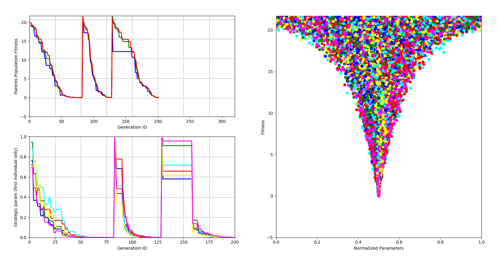
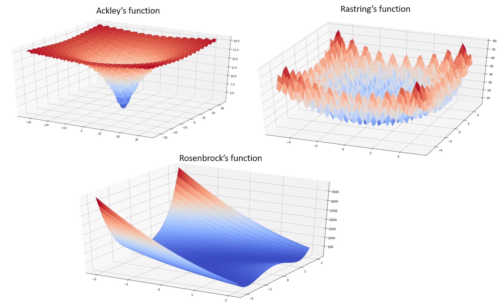
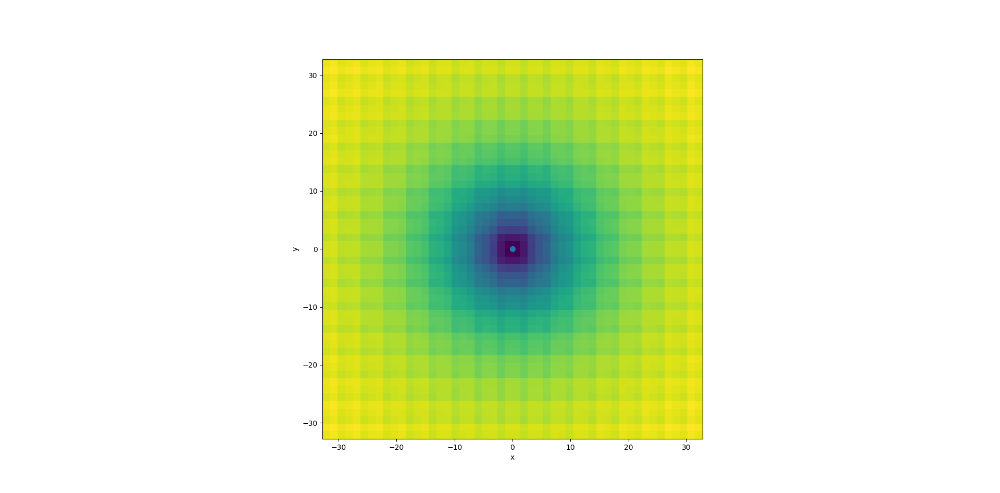

# Evolutionary Strategy optimizazion

# Brief Description
The repository performs optimization tests on several possible cost functions using a self-adaptive Evolutionary Strategy optimizer, with restart option.

Within the implemented Evolutionary Strategy optimizazion, each individual is a class with attributes: object parameters (N dim array of the optimization variables in the real space), endogenous strategy parameters (N dim array of the evolvable standard deviations for each dimension, they are used to control the statistical properties of the mutation operator) and the fitness value. 
The exogenous parameters (that remain constant throughout the optimization) are the number of parents in a population (mu), the number of children generated per each step (lambda = 7) and the number of recombinant parents used to generate one child (rho = 2).

Variables and sigmas are both normalized in (0,1). Initialization of the parent population is random for the variable, and 1.0 for the sigma.

For each ES generation step:

1)	Mutation. Not-isotropic and self-adaptive according to the rule found in literature (“Evolution strategies. A comprehensive introduction” Beyer, HG. & Schwefel, HP. Natural Computing (2002) 1: 3. https://doi.org/10.1023/A:1015059928466). 
	First, the sigmas are mutated by multiplication with a mutation factor: the mutation factor includes a component which is new for each population member and another component which is new for each dimension. This technique allows for learning axes-parallel mutation ellipsoids. Self-adaptability is controlled with an exogenous parameter to which "tau" and "tau_prime" are proportional. 

2)	In the process of offspring generation, I excluded those children whose variables did not lay in the specified search domain and also those sigmas that are larger than 1. If one of those two conditions occurred, a new child was generated until it was right.

3)	Selection. I chose a (mu+lambda) selection, meaning that the parents participate to the selection process and therefore the best individual found so far is preserved (elitist approach). Due to elitism, parents can survive a long time, but I added the restart option to add variability.

4)	Restart option when the ES optimizer is too adapted (i.e. stuck in local minimum). My restart condition was: the sigma are smaller than a certain accuracy value provided by the user (when the algorithm is mutating the parent population within a search range smaller than the wanted accuracy, restart is called.). In the restart a completely new parent generation is reinitialized with sigma = 1.

My general approach: 6 dimensions. The termination condition is the computational time, therefore the number of generations. Self-adaptability has to be tuned to achieve the compromise between quickly converging to the near (possibly local) minimum and having a sufficiently large range of search. The restart option comes to hand when the algorithm is too adapted. After all the parameters (self-adaptability, accuracy) have to be tuned to specific landscape. 

# How to use

run "python ESoptimization.py"